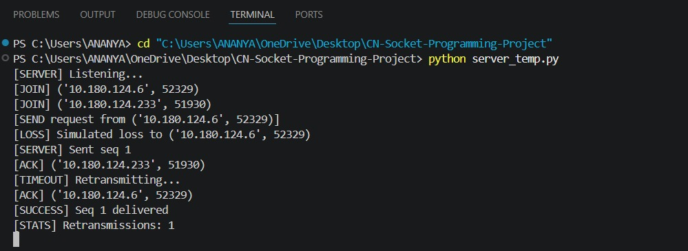
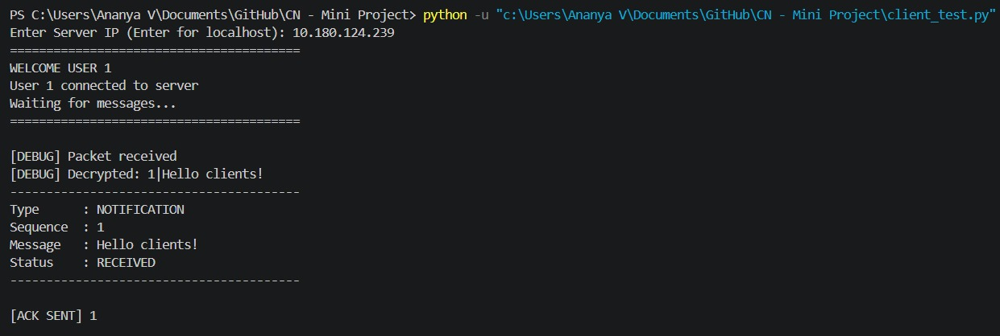

## RELIABLE GROUP NOTIFICATION SYSTEM

## Team Members

- **Ananya Uppili** - PES1UG24CS060
- **Ananya V** - PES1UG24CS061
- **Akanksha P** - PES1UG25CS801

## Overview

This project implements a reliable notification system over UDP with added encryption. Since UDP does not guarantee delivery, ordering, or duplication control, these features are implemented manually.

The system includes:

* A server that sends notifications reliably to connected clients
* A client that receives, orders, and acknowledges messages

## Security

* Uses AES-GCM encryption
* This is to ensure messages are confidential

## Reliability over UDP 

The following is used 

* Sequence numbers for tracking messages
* Acknowledgment (ACK) mechanism
* Retransmissions based on timeout
* Handles packet loss, duplication, and out-of-order delivery

## Client-side Handling

* Detects and labels messages as:

  * RECEIVED
  * DUPLICATE
  * OUT-OF-ORDER
  * BUFFERED
* Maintains correct ordering using a buffer


## Project Structure

```
project/
│── server.py
│── client.py
│── README.md
│── screenshots
```

## Workflow

1. Client sends a JOIN request to the server
2. Server registers the client
3. Client sends a SEND request
4. Server sends notifications with sequence numbers
5. Client:

   * Processes incoming messages
   * Buffers out-of-order messages
   * Sends acknowledgments
   
6. Server retries sending messages until all clients acknowledge

## Output Screenshots

### Server


### Client



## Important Notes

* The server sends messages only if at least one client is connected
* Packet loss is simulated using a probability factor in the server

Example:

```python
LOSS_PROBABILITY = 0.3
```

## Message Format

All messages follow the format:

```
TYPE|SEQUENCE|MESSAGE
```

## Reliability Mechanism

* The server waits for acknowledgments from all clients
* If acknowledgments are not received within a timeout, the message is retransmitted
* Retries stop after a maximum limit

## Concepts Used

* UDP Socket Programming
* Reliable Data Transfer mechanisms
* Acknowledgment and retransmission strategies
* Encryption using AES-GCM
* Buffering and sequencing


